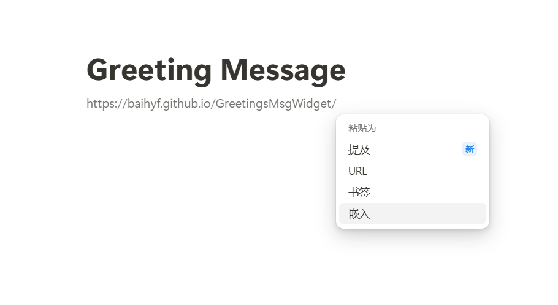
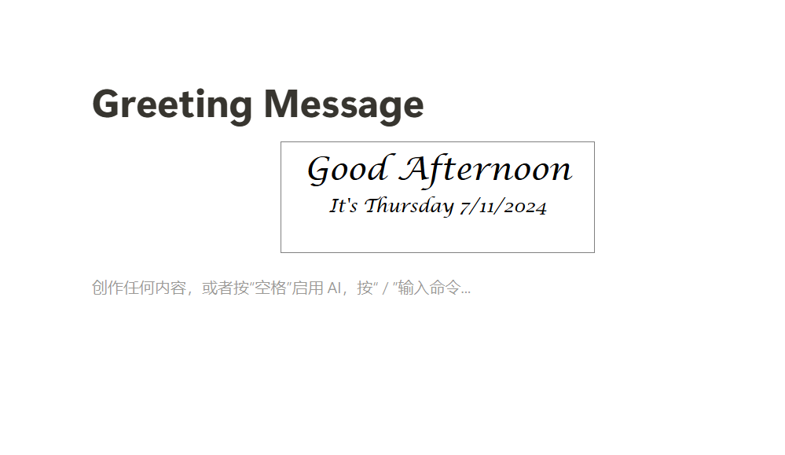

# Greeting Message

A simple notion widget displaying a greeting message with day and time.

Usage:

1. Copy the link: https://baihyf.github.io/GreetingsMsgWidget/ into your notion page.
2. Select `embed` buttom.

3. Now all is done!

